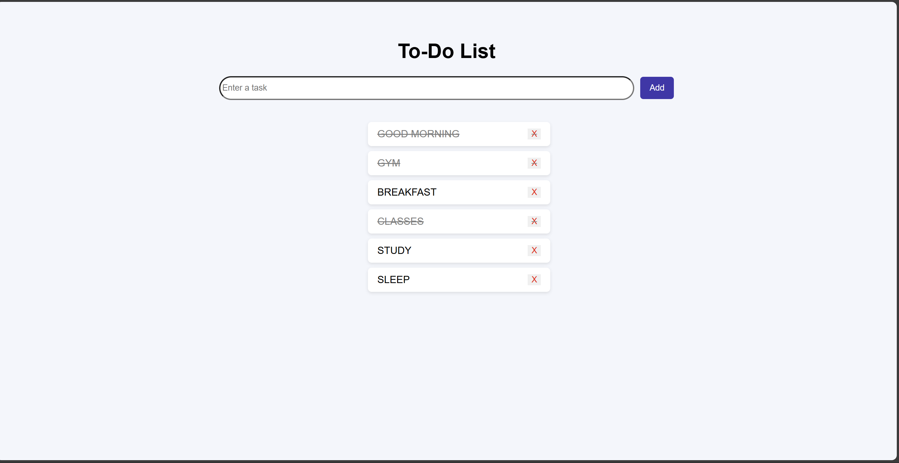

## TO DO LIST WED APP

This is a simple to do web app:
by using:
HTML
CSS
JAVASCRIPT 

## FEATURES 
1.WE CAN ADD OUR TASK.
2.IF WE ARE DONE WITH THE TASK WE CAN MAKE THAT AS COMPLETED(----)
3.WE CAN REMOVE THE TASK.
4.Dynamic UI update without page reload

## HOW TO RUN
Open task2.html file in browser(recommend-chrome).
and make sure the task2.css and task2.js in a same file.

## Project Preview

